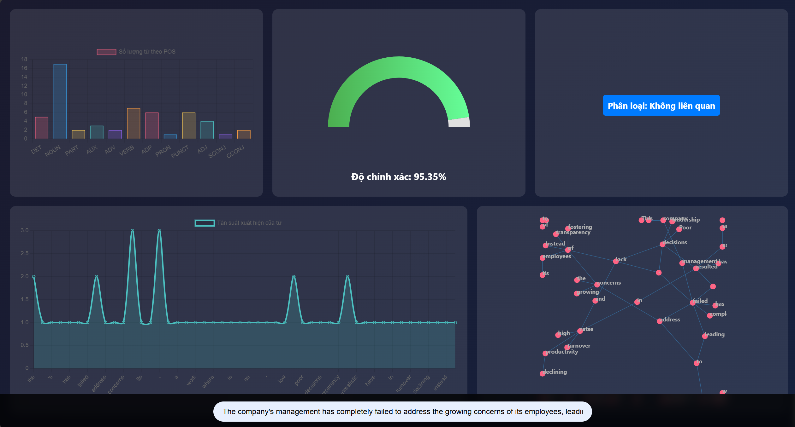
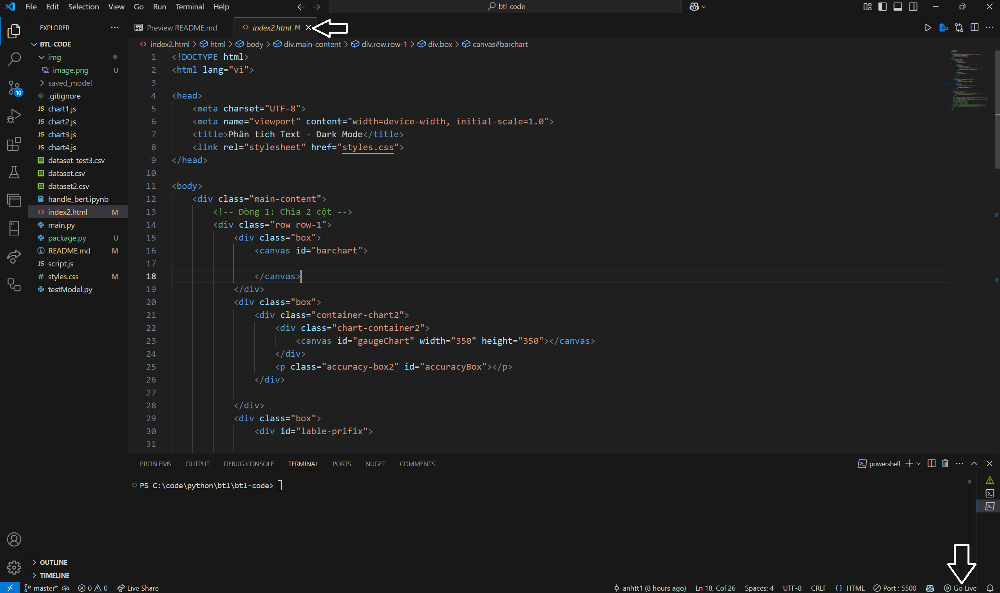

# bài tập lớn lập trình ứng dụng kĩ thuật.
## Đề tài: Phát triển hệ thống nhận diện ngữ nghĩa và phân loại văn bản tự động  
Ứng dụng được xây dựng trên mô hình [BERT](https://huggingface.co/docs/transformers/model_doc/bert) train data theo label và sử dụng [Spyci](https://spyci.readthedocs.io/en/latest/index.html) để nhận diện ngữ nghĩa trong đoạn văn.



## Getting started 

Bài tập sử dụng python 3.12.9 

### Chuẩn bị môi trường và source code để run bài tập.
- clone source code bài tập lớn tại repository này : https://github.com/Ttanhsonsisu/btl-ltud
- Môi trường : 
    - Python 3.12.9 (nếu bạn đang dùng python phiên bản khác vui lòng tải lại đúng phiên bản)
    - ide : 
        - visual studio code
        - postman
- extension in vscode: 
    - Go live (tự tạo một web server đỡ phải tạo thủ công)
### Các package cần có trong bài tập: 
Cài đặt toàn bộ các package trên trang web chính chủ của từng package
- fastapi: Framework để tạo API.
- uvicorn: Chạy ứng dụng FastAPI.
- pydantic: Xử lý dữ liệu đầu vào với mô hình dữ liệu.
- transformers: Thư viện của Hugging Face để tải và sử dụng mô - hình BERT.
- torch: PyTorch, cần thiết để chạy mô hình BERT.
- spacy: Xử lý ngôn ngữ tự nhiên (NLP).
- pandas: Xử lý dữ liệu dưới dạng bảng (dataframe).

Or 
 - run bash
```powershell
pip install fastapi uvicorn pydantic transformers torch spacy pandas
```

Nếu chưa có mô hình tiếng anh cho spacy, hãy tải về: 
```powershell
python -m spacy download en_core_web_sm
```

### Chạy dự án

> [!WARNING]
> phải đúng đường dẫn khi chạy ( từ ổ gốc đến /btl-code)

Tranning model: 

* Mở terminal trên vscode
```powershell 
python -u testModel.py
```
> [!WARNING]
> sau khi chạy xong phải tạo ra được model save_model trong folder repository 

Chạy server api

* Mở terminal vscode:
```powershell
python -u main.py
```

* sau khi đã chạy được server api (api sẽ chạy trên port localhost: 8000)

api predict 
```sh 
curl --location 'http://127.0.0.1:8000/predict' \
--header 'Content-Type: application/json' \
--data '{
    "text": "The company'\''s management has completely failed to address the growing concerns of its employees, leading to a toxic work environment where motivation is at an all-time low."
}'
```
api parse text (phân tích ngữ nghĩa văn bản )
```sh
curl --location 'http://127.0.0.1:8000/parse' \
--header 'Content-Type: application/json' \
--data '{
    "text": "The company'\''s management has completely failed to address the growing concerns of its employees, leading to a toxic work environment where motivation is at an all-time low."
}'
```

> Đây là toàn bộ api cung cấp cho client. (test thành công thì mới chạy được client)

* trên vscode source code dự án chuyển sang file index.html và dùng extension golive bên dưới góc bên phải màn hình để chạy client.


